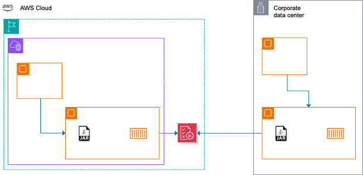

# Introduction

The Amazon Verified Permissions (AVP) Cache project caches the permission requests in the application for low latency look-ups and reduced API calls to Amazon Verified Permissions in AWS regions. As a result, the end application experiences faster look ups and reduced cost of using Amazon Verified Permissions. Further, this application helps reduce HTTP `4xx` status codes from AVP APIs by immediately responding with HTTP `4xx` status codes, than making AVP API calls, in certain scenarios.

- [Introduction](#introduction)
  - [Pre-requisites](#pre-requisites)
  - [Architecture](#architecture)
  - [Launching as a JAR file](#launching-as-a-jar-file)
  - [Launching as a Docker image](#launching-as-a-docker-image)
  - [Usage](#usage)
    - [Querying authorization](#querying-authorization)
    - [Flushing the cache](#flushing-the-cache)
  - [Examples](#examples)
    - [Successful invocation](#successful-invocation)
    - [Failed invocation - non-existing policy store Id](#failed-invocation---non-existing-policy-store-id)
    - [Failed invocation - policy store ID was not passed](#failed-invocation---policy-store-id-was-not-passed)
  - [Hibernate Validations](#hibernate-validations)
  - [Security](#security)
  - [Performance monitoring](#performance-monitoring)
  - [Logging](#logging)
  - [Tests](#tests)

## Pre-requisites

1. [Java JDK](https://www.oracle.com/java/technologies/downloads/#java21) - `17` or higher.
2. [Apache Maven](https://maven.apache.org/) - `3.9.5` or recent.
4. [Docker](https://docs.docker.com/engine/install/) - required only if running as a container image.
5. [GraalVM](https://www.graalvm.org/) - required only if running a native image.
6. AWS IAM user credentials to invoke AVP APIs.

## Architecture

Here is the architecture diagram of where the Amazon Verified Permissions (AVP) Cache solution fits.



The white colored arrows depict the way an end user application will make a call to AVP APIs. The blue colored lines shows the Amazon Verified Permissions (AVP) Cache solution that sits in between the end-user application and AVP. With this deployment, the Amazon Verified Permissions (AVP) Cache solution will respond back with responses from cache if the request was present earlier. Else, it makes a call to AVP, caches it and responds back to the end-user application.

This architecture diagram shows the Amazon Verified Permissions (AVP) Cache solution deployed into an EC2 instance as a native binary, a JAR file or a container image, where, the container image may be run with a container orchestration platform. This solution can also be run as a ECS task or a EKS pod using the container image. Indeed, this solution can also be run on-premises as a JAR file, native binary or as a container image with a container orchestration platform.

## Launching as a JAR file

1. Clone this project into your local environment.

```bash
git clone git@ssh.gitlab.aws.dev:nsubrahm/amazon-verified-permissions-cache.git
cd amazon-verified-permissions-cache
```

2. Build the project.

```bash
./mvnw clean package -DskipTests
```

To run tests, omit `-DskipTests`. See [here](#tests) for more details. To generate native image, use `-Dnative`.

3. Set-up environment variables.

```bash
export AWS_ACCESS_KEY_ID=
export AWS_SECRET_ACCESS_KEY=
```

4. Launch the application.

```bash
java -jar target/quarkus-app/quarkus-run.jar
```

## Launching as a Docker image

1. Clone this project into your local environment.

```bash
git clone git@ssh.gitlab.aws.dev:nsubrahm/amazon-verified-permissions-cache.git
cd amazon-verified-permissions-cache
```

2. Build the project.

```bash
./mvnw clean package -DskipTests
```

To run tests, omit `-DskipTests`. See [here](#tests) for more details. 

To generate native image, use `-Dnative`.

3. Generate container image.

```bash
docker build -f src/main/docker/Dockerfile.jvm -t quarkus/avpcache:latest .
```

To generate other variants of container image, follow comments in the `Dockerfile`s at `src/main/docker`.

4. Set-up environment variables.

```bash
export AWS_ACCESS_KEY_ID=
export AWS_SECRET_ACCESS_KEY=
```

5. Launch the application.

```bash
docker run --rm -it --name avpache -p 8080:8080 --env AWS_ACCESS_KEY_ID --env AWS_SECRET_ACCESS_KEY quarkus/avpcache:latest
```

## Usage

There are two ways of usage:

1. [Querying authorization](#querying-authorization)
2. [Flushing the cache](#flushing-the-cache)

### Querying authorization

1. Configure your REST client to send HTTP `POST` requests to `/permissions/authz?region=regionName` endpoint where, `regionName` is a required parameter.
2. Append a query param `region` set to a AWS region ID against which the permission is to be queried.
3. The payload is a JSON document that must comply with the request syntax for [invocation of `IsAuthorized` API](https://docs.aws.amazon.com/verifiedpermissions/latest/apireference/API_IsAuthorized.html).

> As of Jan '24, the `context` and `entities` keys in the payload are _not_ supported.

3. Two kinds of responses are possible.
   1. Compliant with response of invocation of [`IsAuthorized` API](https://docs.aws.amazon.com/verifiedpermissions/latest/apireference/API_IsAuthorized.html).
   2. Compliant with response of [Hibernate validation](https://hibernate.org/validator/).

### Flushing the cache

To flush the cache, send a HTTP `DELETE` request to `/permissions/flush?region=regionName&policyStoreId=policyStoreId` where, both `regionName` and `policyStoreId` are required query parameters.

## Examples

For a more examples, see the test file - [`PermissionCacheTest.java`](src/test/java/com/demos/aws/PermissionsCacheTest.java).

### Successful invocation

The following JSON is semantically valid and uses actual values set-up in AVP.

```json
{
  "principal": {
      "entityType": "books::User", 
      "entityId": "user"
  },
  "action": {
      "actionType": "books::Action",
      "actionId": "ReadBook"
  }, 
  "resource": {
      "entityType": "books::book", 
      "entityId": "book"
  },
  "policyStoreId": "validPolicyStoreId"
}
```

The following is the response.

```json
{
  "decision": "ALLOW",
  "determiningPolicies": [
    {
      "policyId": "validPolicyStoreId"
    }
  ],
  "errors": []
}
```

### Failed invocation - non-existing policy store Id

The following JSON is semantically valid. However, the policy store ID does not exist.

```json
{
  "principal": {
      "entityType": "books::User", 
      "entityId": "user"
  },
  "action": {
      "actionType": "books::Action",
      "actionId": "ReadBook"
  }, 
  "resource": {
      "entityType": "books::book", 
      "entityId": "book"
  },
  "policyStoreId": "doesNotExist"
}
```

The following is the response.

```json
{
  "exception": "ResourceNotFoundException",
  "requestId": "7400fc1d-2c59-4a29-9204-4d9dc0143418",
  "statusCode": 404,
  "message": "Policy store with id 'doesNotExist' not found (Service: VerifiedPermissions, Status Code: 404, Request ID: 7400fc1d-2c59-4a29-9204-4d9dc0143418)"
}
```

### Failed invocation - policy store ID was not passed

The following JSON is semantically valid. However, the required request element, policy store ID, was not sent.

```json
{
  "principal": {
      "entityType": "books::User", 
      "entityId": "user"
  },
  "action": {
      "actionType": "books::Action",
      "actionId": "ReadBook"
  }, 
  "resource": {
      "entityType": "books::book", 
      "entityId": "book"
  }
}
```

The following is the response from Hibernate Validation.

```json
{
  "title": "Constraint Violation",
  "status": 400,
  "violations": [
    {
      "field": "validatePolicyStoreId.policyStoreId",
      "message": "Policy Store Id is required."
    }
  ]
}
```

## Hibernate Validations

This application responds with HTTP status code `400` when the following violations occur.

1. Missing `regionName` in query string of HTTP calls.
2. Missing `regionName` and `policyStoreId` when flushing the cache.
3. Missing `policyStoreId` in payload.
4. Malformed `policyStoreId` in payload.
5. Malformed `principal`, `action` or `resource` objects in payload.

See [request syntax](https://docs.aws.amazon.com/verifiedpermissions/latest/apireference/API_IsAuthorized.html) for more details.

## Security

This solution requires AWS credentials be provisioned via environment variables. In production deployments, these variables should be provisioned via AWS Secrets Manager. Protecting the endpoint against DDoS attacks should be enabled with AWS Shield and AWS WAF. Securing the endpoint with TLS can be [configured](https://quarkus.io/guides/http-reference#providing-a-certificate-and-key-file) by providing paths of certificate files.

## Performance monitoring

This application is instrumented with [Micrometer Metrics](https://quarkus.io/guides/telemetry-micrometer) for Prometheus. Therefore, REST API invocation and cache metrics will be available for scraping.

## Logging

By default, logging destination is set to console. For other configuration parameters, see [here](https://quarkus.io/guides/http-reference#configuring-http-access-logs). To disable HTTP logging, set up the environment variable `QUARKUS_HTTP_ACCESS_LOG_ENABLED` to `false`.

## Tests

To run tests, do the following steps.

1. Create a policy store in AVP. 
2. Add with the following policies.

a. Permit a principal named as `user` to read a book.

```rs
permit(
  principal == bookStore::User::"user",
  action in [bookStore::Action::"ReadBook"],
  resource == bookStore::Book::"book"
) when {
  true
};
```

b. Forbid a principal named as `reader2` to read a book.

```rs
forbid(
  principal == bookStore::User::"reader2",
  action in [bookStore::Action::"ReadBook"],
  resource == bookStore::Book::"thriller"
) when {
  true
};
```

3. Export the following environment variables.

```bash
export AWS_ACCESS_KEY_ID=
export AWS_SECRET_ACCESS_KEY=
export REGION_ID=
export POLICY_STORE_ID=
```

4. To run tests, go to the `avp` folder of the cloned project and run the following command.

```bash
./mvnw clean package
```
